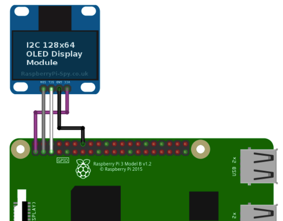

# piphone
Raspberry PI based VoIP Phone development


## LCD
TZT 0.96 inch oled IIC Serial White OLED Display Module 128X64 I2C SSD1306 12864 LCD Screen Board GND VDD SCK SDA For Arduino


What to put on the bus I2C?
I have 0x3c fits
0x3c. Better check scanner I2C.

## Wiring



## python
```
sudo apt-get install python3-pip
pip3 install adafruit-circuitpython-ssd1306
sudo apt-get install python3-pil
```

Speeding up the Display on Raspberry Pi
```
sudo nano /boot/config.txt
dtparam=i2c_baudrate=1000000
```

```
apt-get install wiringp
gpio -v

i2cdetect -y 1


/usr/bin/python3 /root/lcd_ip.py TEST
```


<br/><br/><br/><br/><br/><br/><br/><br/><br/><br/><br/><br/><br/><br/><br/><br/><br/><br/><br/><br/><br/><br/><br/>

Reference:
1. https://learn.adafruit.com/monochrome-oled-breakouts/python-usage-2
2. https://www.raspberrypi-spy.co.uk/2018/04/i2c-oled-display-module-with-raspberry-pi/